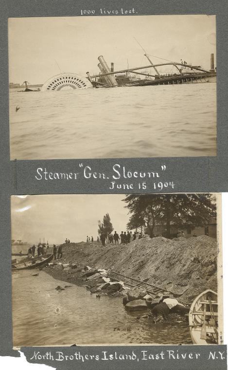
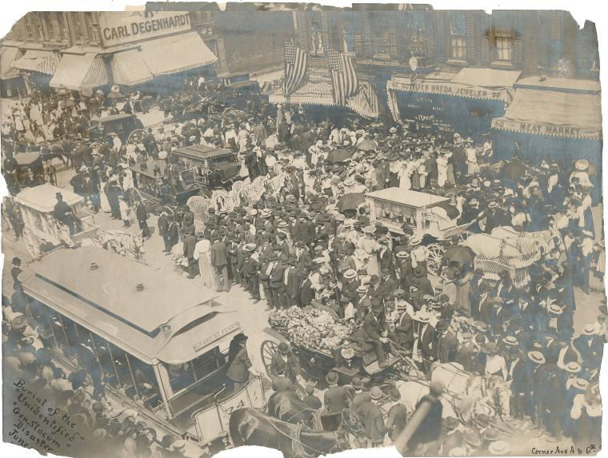

The General Slocum Disaster occurred on June 15, 1904. This tragedy is much less well known compared to the Triangle Shirtwaist Factory Fire of March 25, 1911, and the Titanic Disaster of April 15, 1912. Perhaps these two shocking events happening within a year focused people's attention elsewhere. But the aftermath of the sinking of the PS Slocum radically altered the German-American community of the Lower East Side forever...    

The PS Slocum, built in 1891, was a paddle boat or sidewheel passenger ship. On June 15, 1904, the ship carried 1,358 passengers, plus crew.

Chartered by the St. Mark's Evangelical Lutheran Church for $350.00, the passengers came mostly from the German-American community of the Lower East Side. Excitement and anticipation filled the air — for the passengers, this would be a fun-filled day outside of the city, and as the ship departed, it would be enjoyable to watch the shoreline as the ship made its way out to the North Shore of Long Island.

Most of the passengers were women and children. As the ship made its way up the East River, good times turned bad very quickly. There have been varying accounts of how the fire started, but it spread rapidly within a half hour of leaving dock around 9 a.m. The panic was horrific among the passengers as they faced death by drowning or being burned alive on the ship. It was a safe bet that most of the passengers could not swim, and the period clothing of the day worked against them. 

**The Aftermath**

For days afterward, bodies would wash ashore. Only 321 passengers survived from a total of 1,358 passengers. The final death count totaled 1,021. The next largest death toll in the United States would come decades later with 2,974 dead from 9/11.

There would be miracle stories of survivors for the lucky few and heartbreak for those who lost loved ones. It was widely reported that Captain William Henry Van Schaick would not bring the ship to shore for insurance reasons. Instead, Van Schaick steered the burning ship to North Brother Island. Van Schaick would testify that gas tanks and lumber yards made landing near 130th Street, close to the Bronx, dangerous.

**Testimony and Partial Justice**

Testimony that would follow in the days ahead established that there were few safeguards; life vests were rotten, life boats were in the same state, fire drills were non-existent, and the crew was untrained to handle the panic that followed on board the Slocum. Eyewitnesses from the shore could see the boat burning and wondered why the captain did not come to shore.  Quickly, Van Schaick and the Knickerbocker Steamboat Company came under the crosshairs of an investigation. Frank A. Barnaby, the President of the company, defended the actions of the captain and the crew.

On January 27, 1906, justice was meted out to Captain Van Schaick by a jury of the United States Circuit Court. He was found guilty of criminal negligence that he had failed to maintain the fire drills required by law. Judge Thomas, the presiding judge, sentenced Van Schaick to 10 years at hard labor. And what happened to the company that owned the ship and the director? The Knickerbocker Steamboat Company and Frank Barnaby escaped justice. 

Van Schaick would serve only part of his sentence at Sing Sing prison. He received a pardon (through the efforts of his wife) from President William Howard Taft in 1911. 

